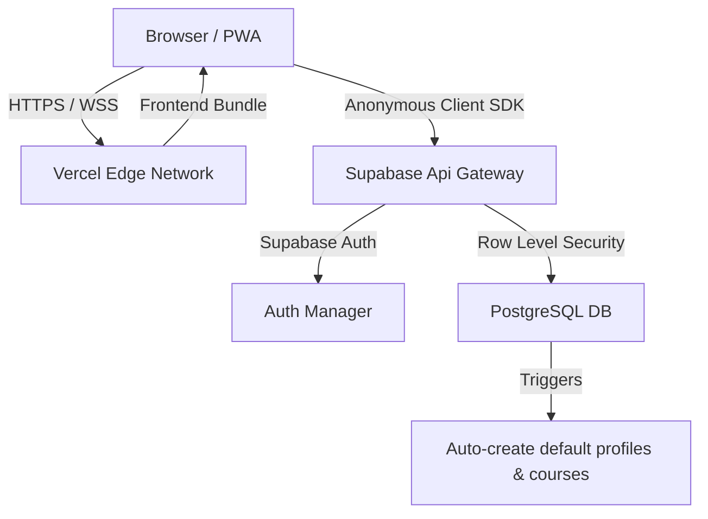

# Semester 5 — Academic OS (Production Deployment Guide)

Welcome to the **Academic OS** for Semester 5 at IIIT-Delhi. This project has been upgraded from a local-only mockup into a secure, cloud-backed personal dashboard.

This application is powered by:
* **Frontend**: Vanilla JS + HTML5 + CSS3 built with **Vite**
* **Hosting**: **Vercel**
* **Database & Auth**: **Supabase** (PostgreSQL + Auth + Row Level Security)
* **PWA**: Installable standalone application with service worker caching

---

## 🏛️ Architecture Overview



All data is sandboxed per user in a relational PostgreSQL schema. LocalStorage is used strictly as a fast offline read cache and fallback sync buffer.

---

## 🛠️ Local Development Setup

To run the application locally on your Mac:

### 1. Prerequisites
Ensure you have **Node.js** (v18+) and npm installed on your system.

### 2. Install Dependencies
Clone the repository and run:
```bash
npm install
```

### 3. Setup Environment Variables
Create a local `.env` file in the root directory (this file is ignored by Git):
```env
VITE_SUPABASE_URL=https://your-project-id.supabase.co
VITE_SUPABASE_ANON_KEY=your-public-anon-key-here
```
*(Reference `.env.example` for the templates).*

### 4. Run Development Server
Start the local server:
```bash
npm run dev
```
Open `http://localhost:5173` in your browser.

---

## ⚡ Supabase Setup (PostgreSQL & RLS)

Follow these steps to configure your Supabase backend:

### 1. Database Schema
Open the **SQL Editor** in your Supabase dashboard, paste the contents of [schema.sql](file:///Users/legend27648/Documents/SEM_5/Notion%20online/schema.sql), and run the script. This creates:
* **Tables**: `profiles`, `settings`, `courses`, `assessments`, `marks`
* **Trigger**: `on_auth_user_created` which automatically registers the 7 default Semester 5 courses and settings for any user upon signing up.

### 2. Row Level Security (RLS) Policies
Row Level Security is enabled on all tables by the schema script. This ensures users can **only** query, modify, or delete their own data. Policies follow the template:
```sql
create policy "Users can view and edit their own courses"
  on public.courses for all using (auth.uid() = user_id);
```

### 3. Authentication Configuration
1. Go to **Authentication** -> **Providers** in Supabase.
2. Enable **Email / Password** authentication.
3. (Optional) Turn off **Confirm Email** if you want instant registration without waiting for confirmation links.

---

## 🚀 Vercel Deployment

Deploying the frontend takes less than 2 minutes:

### 1. Import Repository
1. Log in to the [Vercel Dashboard](https://vercel.com).
2. Click **New Project** and import your GitHub repository.

### 2. Environment Variables
Under the **Environment Variables** section during project configuration, add:
* `VITE_SUPABASE_URL` -> *(Your Supabase Project URL)*
* `VITE_SUPABASE_ANON_KEY` -> *(Your Supabase Public Anon Key)*

### 3. Build & Deploy
Click **Deploy**. Vercel will run `npm run build` and serve your static asset package at a secure production URL.

---

## 📅 Data Mappings & Core Formulas

The math calculations are handled dynamically on the client side to keep database operations light:

* **Assessment Percentage**: 
  $$\text{Percentage} = \frac{\text{marks\_obtained}}{\text{max\_marks}} \times 100$$
* **Assessment Weighted Score**:
  $$\text{Weighted Score} = \frac{\text{Percentage} \times \text{weightage}}{100}$$
* **Course Current Marks**: Sum of weighted scores from graded assessments (out of 100).
* **Course Assessment Progress**: Sum of graded assessment weightages (tracks what percentage of the syllabus evaluation is completed).
* **Syllabus Progress**: Manually entered by the student (0-100%).

*Note: If no marks have been logged for a course, the UI displays `—` rather than `0%` to clearly distinguish "No Marks Graded" from "Scored 0%".*

---

## 💾 Backups & Data Portability

To guarantee your academic data remains portable:

* **Export Data**: Click **Export Data (JSON)** in the sidebar footer. This compiles your entire academic state (settings, courses, assessments, and marks) and triggers a browser download.
* **Import Data**: Click **Import Data (JSON)**, select a valid backup file, and confirm the destructive overwrite alert. The engine will clear your current database and securely insert the imported structures, maintaining referential relationships.

---

## 🚨 Troubleshooting & Cache Controls

* **Offline Status**: If your connection drops, the sidebar indicator changes to **Offline Cache Mode**. Edits are cached locally in your browser's LocalStorage and will attempt to sync automatically when `window` receives the `online` event.
* **Reset All Data**: Clears all custom assessments and marks, returning the workspace courses to the 7 original empty course templates.
* **Service Worker Cache**: If updates to CSS or JS are not visible, run `Force Refresh` (`Cmd + Shift + R`) to bypass PWA caching.
